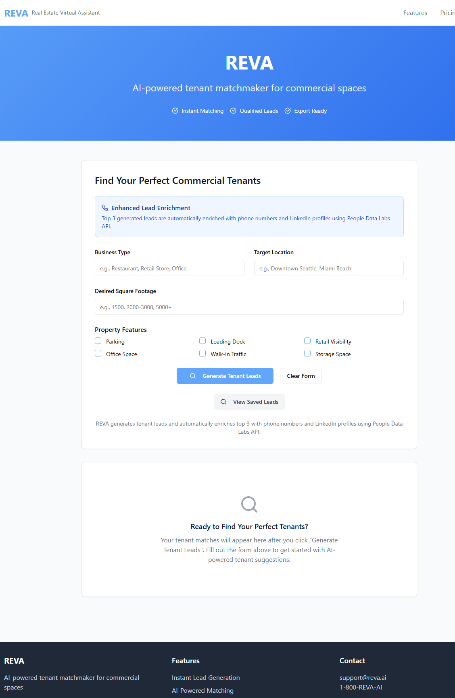
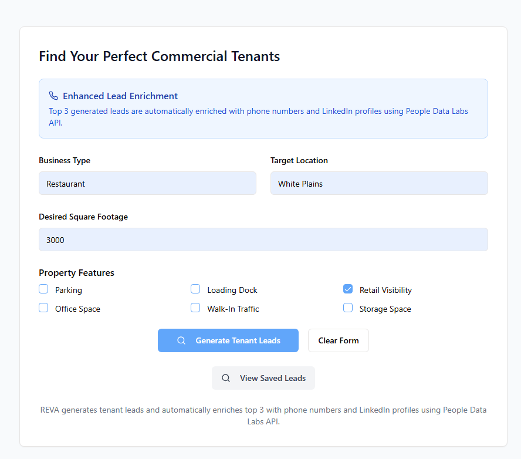
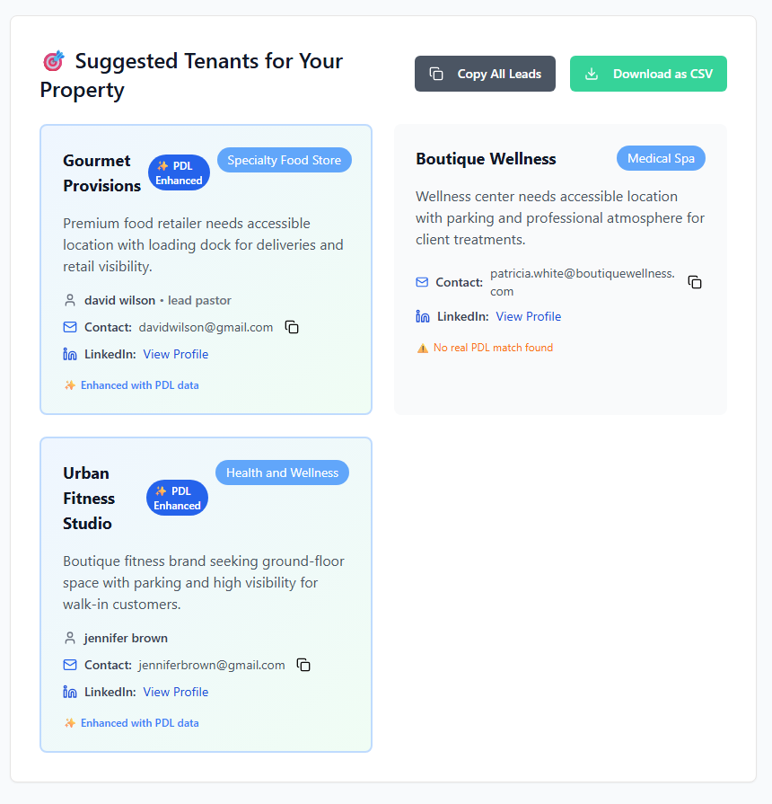

# REVA - Real Estate Virtual Assistant

A comprehensive commercial real estate lead generation platform that leverages AI, advanced data enrichment, and intelligent matching technologies to connect businesses with ideal property spaces.

## 🔧 Features
- AI-Powered Lead Generation – Generate targeted tenant leads based on property requirements
- People Data Labs Integration – Automatic enrichment of leads with phone numbers, LinkedIn profiles, and professional details
- Real-time Data Processing – Live API calls to PDL for authentic contact information
- Export Capabilities – CSV export and clipboard functionality for lead management
- Advanced Filtering – Filter saved leads by industry, contact name, and keywords
- Responsive Design – Mobile-first design with Tailwind CSS

## 🖼️ Screenshots
| Dashboard Overview | Lead Generation Panel | Enriched Lead Results |
|--------------------|-----------------------|-----------------------|
|  |  |  |
| Lead Filtering | Export Options | Mobile View |
|----------------|----------------|-------------|
|  |  |  |

## 🖥️ Technology Stack
**Frontend**
- React 18 with TypeScript
- Vite for development and building
- shadcn/ui components with Radix UI primitives
- Tailwind CSS for styling with CSS variables for theming
- TanStack Query for server state management
- React Hook Form with Zod validation
- Wouter for client-side routing

**Backend**
- Express.js with TypeScript
- PostgreSQL with Drizzle ORM for type-safe database operations
- Neon Serverless PostgreSQL database
- People Data Labs API for contact enrichment
- Comprehensive Security: Helmet, CORS, rate limiting, input validation
- Performance Monitoring: Request metrics and health checks
- Caching System: In-memory cache with TTL for API responses

## 🛡️ Security Features
- Rate Limiting – Multiple layers of rate limiting for API protection
- Input Validation – Server-side validation with express-validator and Zod
- Security Headers – Comprehensive security headers with Helmet
- API Key Management – Environment variables for sensitive data
- Error Handling – Secure error responses without sensitive information exposure
- CORS Configuration – Proper CORS setup for production and development

## 🚀 Setup Instructions
**Prerequisites**
- Node.js 18+
- PostgreSQL database (Neon Serverless recommended)
- People Data Labs API key

**Environment Variables**
DATABASE_URL=your_postgresql_connection_string
PDL_API_KEY=your_people_data_labs_api_key
SESSION_SECRET=your_session_secret_key

**Installation**
1. Clone the repository and install dependencies:
   git clone https://github.com/your-username/reva.git
   cd reva
   npm install
2. Set up your environment variables in Replit Secrets or .env file
3. Push the database schema:
   npm run db:push
4. Start the development server:
   npm run dev
   The application will be available at http://localhost:5000

**Production Build**
npm run build
npm run start

## 📡 API Endpoints
**Lead Management**
- POST /api/leads – Create and enrich new leads
- GET /api/leads – Retrieve all leads with pagination
- GET /api/health – Health check and performance metrics

**Rate Limits**
- General API: 100 requests per 15 minutes per IP
- Lead Generation: 5 requests per minute per IP (resource-intensive)
- Slow Down: Progressive delays after 10 requests per 15 minutes

## 🗃️ Database Schema
**Leads Table**
- Primary identifiers and business information
- PDL enrichment fields (phone, enrichedName, title)
- Timestamps and enrichment status flags
- Optimized indexes for common queries

## ⚡ Performance Optimizations
- Database indexes on commonly queried fields
- In-memory caching for PDL API responses
- Request monitoring and metrics collection
- Pagination for large datasets

## 🔒 Security Measures
**Input Validation**
- Server-side validation for all input fields
- Email format validation before API calls
- URL validation for website and LinkedIn URLs
- Length limits and content sanitization

**API Security**
- Rate limiting on all endpoints
- CORS configuration for allowed origins
- Content Security Policy headers
- Request size limits to prevent DoS attacks

**Data Protection**
- API keys stored in environment variables
- Secure error handling without information leakage
- Password requirements for future authentication features
- JWT token-based authentication ready

## 📊 Monitoring and Performance
**Health Monitoring**
- Real-time performance metrics
- Error rate tracking
- Slow request detection and logging
- Memory usage monitoring

**Caching Strategy**
- PDL API responses cached for 1 hour (successful)
- Negative results cached for 30 minutes
- Automatic cache cleanup every 10 minutes
- Cache statistics and monitoring

## 🛠️ Development Guidelines
**Code Quality**
- TypeScript strict mode enabled
- Comprehensive error handling
- Clean separation of concerns
- Consistent naming conventions
- Detailed code comments

**Best Practices**
- Environment-based configuration
- Proper logging without sensitive data exposure
- Modular architecture with middleware
- Type safety throughout the stack
- Security-first development approach

## 📄 License
MIT License - See LICENSE file for details

## 📞 Support
For issues and support, please refer to the project documentation or contact the development team.
